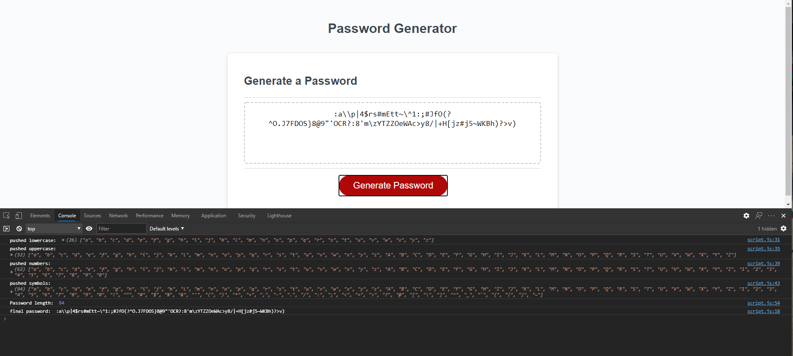

# 03 JavaScript: Password Generator

This project is about using Javascript to make an in-browser password generator. The generated password should meet certain criteria based on user input, such as length, and whether it should include different types of characters.

## Technologies used
- HTML
- CSS
- Javascript
- Git
- GitHub

[Website](https://sammyk118.github.io/JS-Cool-Password-Generator/)


## What I did
- I filled out the JavaScript to ask about password specifications, whic involved creating an empty masterArray[] and pushing specific arrays into that based on user input.
```javascript
if (confirm("lowercase?"))
    //push all lowercase characters into masterArray
    Array.prototype.push.apply(masterArray, lowerArray);
```
* After getting all the necessary criteria from the user, we move on to generating the password.
```javascript
function generatePassword() {
  for (var i = 0; i < passwordLength; i++) {
    //get a random index value from masterArray for the next character 
    var char = getRandomInt(masterArray.length - 1);
    password.push(masterArray[char]);
  }
  //join array into a string
  password = password.join('');
}
```

## Author

**Sammy Kroner**

[LinkedIn](www.linkedin.com/in/samuel-kroner-44aa11169)

[GitHub](https://github.com/sammyk118)

## Acknowledgements
UC Berkeley Extension, and w3schools for pushing arrays
